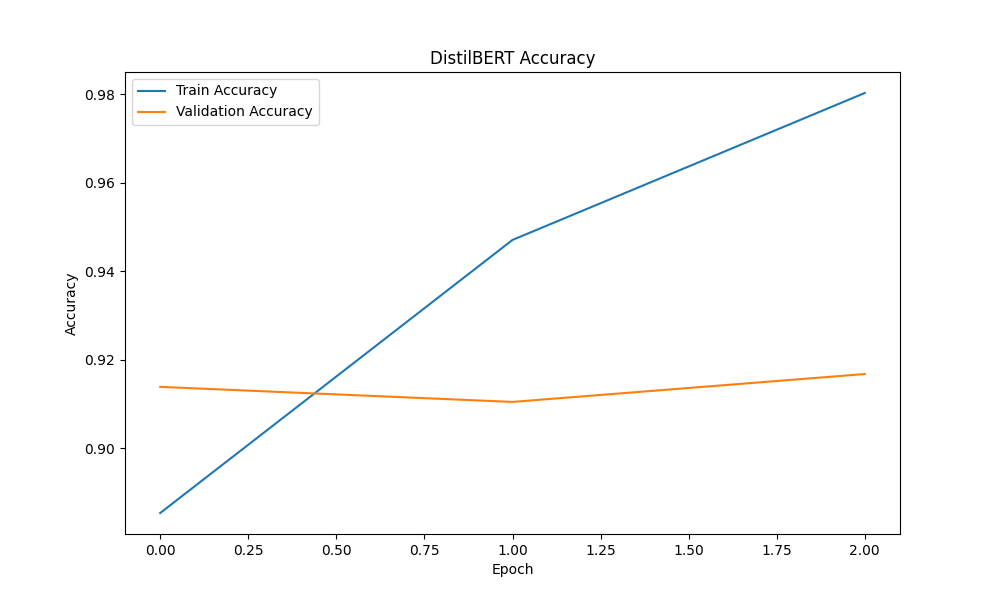
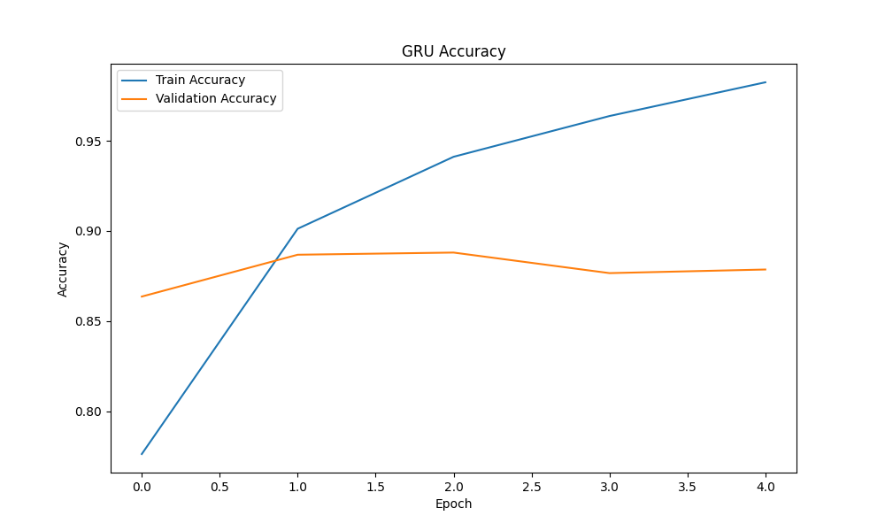
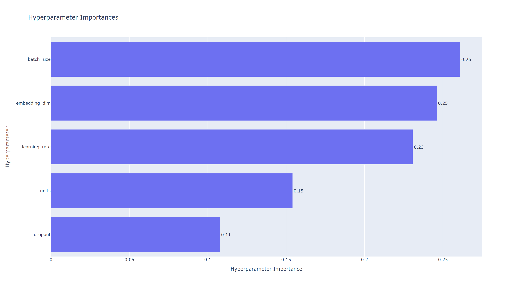

# 🎬 CineSense — Intelligent Movie Review Sentiment Analysis

<!-- <p align="center">
  
</p> -->

<p align="center">


</p>

---

# 📌 Overview

CineSense is a deep learning powered movie review sentiment analysis platform that classifies movie reviews as **Positive** or **Negative** using multiple NLP architectures ranging from classical recurrent neural networks to transformer based models.

**Live App:** [Access CineSense on Hugging Face Spaces](https://huggingface.co/spaces/anantj09/CineSense)

The project combines:

- Deep Learning for NLP
- Transformer Models
- GPU Accelerated Training
- Flask Deployment
- Modern Futuristic Frontend
- Config Driven ML Architecture
- Experiment Tracking & Visualization

The system was trained on the IMDB Movie Reviews Dataset and supports multiple models including:

- LSTM
- GRU
- BiLSTM
- DistilBERT Transformer

---

# 🚀 Features

- Multiple NLP Deep Learning Models  
- Transformer Based Sentiment Analysis  
- GPU Accelerated TensorFlow Training  
- DistilBERT Transformer Integration  
- Modern UI  
- Flask Based Deployment  
- Config Driven Architecture  
- Experiment Tracking  
- Training Visualizations  
- Hyperparameter Tuning using Optuna  
- Unified Prediction Pipeline  
- Docker Support  
- Production Ready Project Structure

---

# 🧠 Models Implemented

| Model | Type | Accuracy |
|---|---|---|
| LSTM | Recurrent Neural Network | 84.9% |
| GRU | Gated Recurrent Unit | 88.3% |
| BiLSTM | Bidirectional LSTM | 85.3% |
| DistilBERT | Transformer | 91.7% |

---

# 🏗️ System Architecture

<p align="center">
  
</p>

---

# 🖥️ UI Screenshots

## Homepage

<p align="center">
  
</p>

---

## Dashboard

<p align="center">
  
</p>

---

# 📈 Training & Evaluation Visualizations

## Model Convergence Metrics (DistilBERT & GRU)

<p align="center">
  
  
</p>

---

## Benchmarks & GRU Hyperparameter Importance

<p align="center">
  
  
</p>

Optimized parameters included:
- Learning Rate
- Dropout
- Dense Units
- Recurrent Units
- Batch Size

---

# 📂 Project Structure

```bash
micro_IMDBReview/
│
├── assets/
├── configs/
├── experiments/
├── src/
│   ├── components/
│   ├── models/
│   ├── pipelines/
│   ├── transformers/
│   └── utils/
│
├── static/
├── templates/
├── tests/
│
├── app.py
├── setup.py
├── Dockerfile
├── requirements.txt
└── README.md
```

---

# ⚙️ Config Driven Architecture

The entire project uses YAML driven configurations.

## Training Configuration

```yaml
batch_size: 32
epochs: 5
validation_split: 0.2
```

## Model Configuration

```yaml
embedding_dim: 128
max_features: 10000
max_sequence_length: 200
```

## Paths Configuration

```yaml
models_dir: artifacts/models/
plots_dir: artifacts/plots/
```

This makes the pipeline:
- reusable
- modular
- scalable
- production oriented

---

# 🧪 Dataset

Dataset Used:
- IMDB Movie Reviews Dataset

Source:
- Keras Datasets API

The dataset contains:
- 50,000 movie reviews
- Binary sentiment labels
- Balanced positive and negative reviews

---

# 🧠 Transformer Integration

The project integrates:
- HuggingFace Transformers
- DistilBERT
- TensorFlow Transformers Pipeline

Features:
- Tokenization
- Attention Masking
- GPU Accelerated Training
- Mixed Precision Training
- XLA Optimization

---

# ⚡ GPU Training Setup

The models were trained using:

- NVIDIA RTX 3050 Laptop GPU
- CUDA
- cuDNN
- TensorFlow GPU
- WSL2 Ubuntu Environment

Training acceleration techniques:
- Mixed Precision Training
- XLA Compilation
- CUDA Memory Optimization

---

# 🧩 Tech Stack

## Backend
- Python
- Flask
- TensorFlow
- HuggingFace Transformers

## Frontend
- HTML
- CSS
- JavaScript

## ML & NLP
- LSTM
- GRU
- BiLSTM
- DistilBERT

## Visualization
- Matplotlib
- Seaborn
- Optuna

---

# 🐳 Docker Support

Build Docker Image:

```bash
docker build -t cinesense .
```

Run Container:

```bash
docker run -p 7860:7860 cinesense
```

---

# ▶️ Installation & Setup

## Clone Repository

```bash
git clone https://github.com/anantj09/CineSense
```

---

## Create Environment

```bash
conda create -n imdb_env python=3.10
conda activate imdb_env
```

---

## Install Requirements

```bash
pip install -r requirements.txt
```

---

## Run Application

```bash
python app.py
```

---

# 🌐 Launch Application

Open browser:

```bash
http://127.0.0.1:7860
```

---

# 📊 Final Performance Summary

| Model | Accuracy | Precision | Recall | F1 Score |
|---|---|---|---|---|
| LSTM | 84.9% | 87.6% | 81.2% | 84.3% |
| GRU | 88.3% | 86.4% | 90.8% | 88.5% |
| BiLSTM | 85.3% | 85.0% | 85.7% | 85.4% |
| DistilBERT | 91.7% | 91.0% | 92.4% | 91.7% |

---

# 🔮 Future Work

Possible future enhancements:

- LLM Based AI Insights Panel
- Explainable AI Sentiment Reasoning
- Attention Visualization
- Ensemble Learning
- Multilingual Sentiment Analysis
- Speech-to-Review Sentiment Analysis
- Real-Time Streaming API
- User Authentication System
- Sentiment Trend Analytics Dashboard
- Fine Tuned RoBERTa/BERT Models

---

# 👨‍💻 Author

Developed by:

**Anant Jain**

---

# ⭐ Acknowledgements

- TensorFlow
- HuggingFace
- Keras
- Optuna
- Flask
- IMDB Dataset

---

# 📜 License

This project is intended for educational and portfolio purposes.