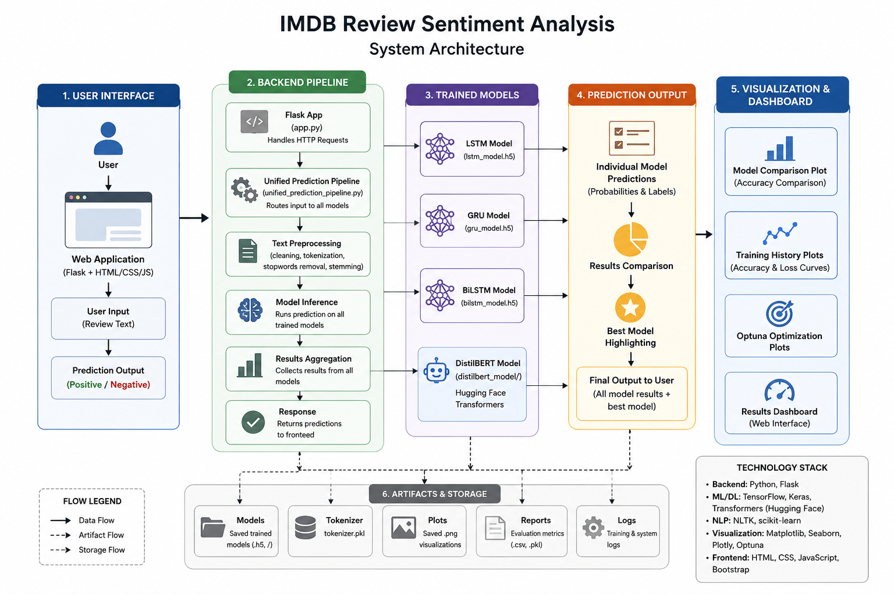
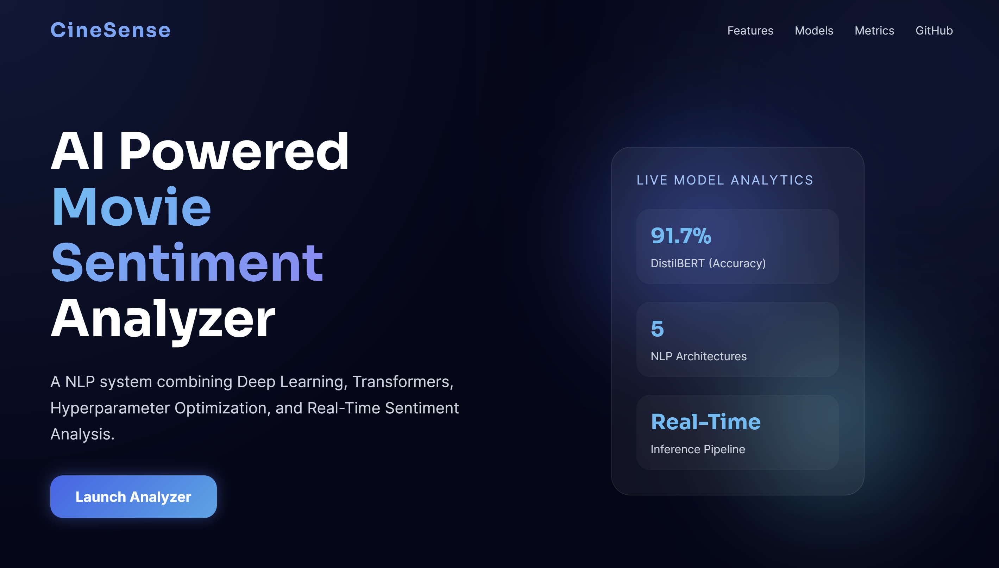
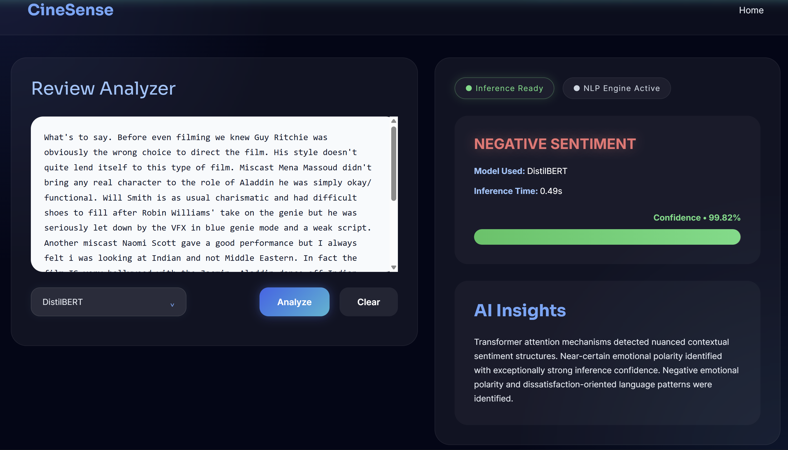
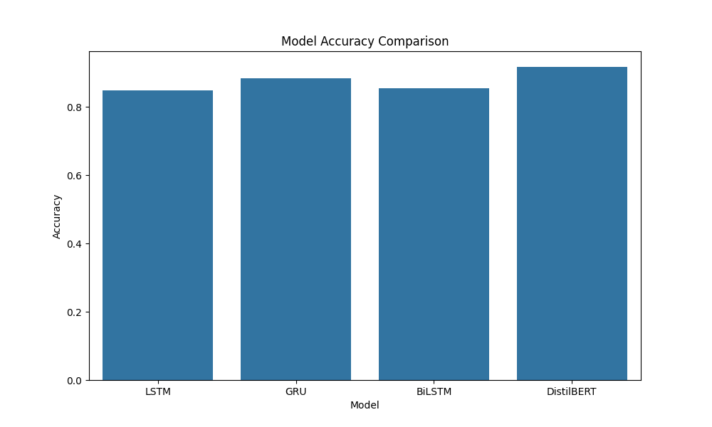

# 🎬 CineSense: Intelligent Movie Review Sentiment Analysis


---

# 📌 Overview

CineSense is a deep learning movie review sentiment analysis platform that classifies text as **Positive** or **Negative**. It serves as a production-grade template for config-driven, end-to-end NLP pipelines by combining:
* **Multi-Model Benchmarking**: Evaluating recurrent networks (LSTM, GRU, BiLSTM) against state-of-the-art transformer architectures (`distilbert-base-uncased`).
* **GPU-Accelerated Training**: Utilizing NVIDIA CUDA & cuDNN with mixed-precision training and XLA compilation to maximize speed.
* **Optuna Hyperparameter Tuning**: Optimizing dropout, learning rate, and layer sizes automatically.
* **Interactive Web Interface**: A modern futuristic Flask application showcasing real-time predictions, classification probabilities, and dynamic model benchmarks.

**Live App:** [Access CineSense on Hugging Face Spaces](https://huggingface.co/spaces/anantj09/CineSense)

---

# 🏗️ System Architecture

<p align="center">
  
</p>

---

# 🖥️ UI Screenshots

<p align="center">
  
  
</p>

---

# 📈 Training & Evaluation Visualizations

## Performance Benchmarks

<p align="center">
  
</p>

---

# 📂 Project Structure

```bash
micro_IMDBReview/
│
├── assets/
├── configs/
├── experiments/
├── src/
│   ├── components/
│   ├── models/
│   ├── pipelines/
│   ├── transformers/
│   └── utils/
│
├── static/
├── templates/
├── tests/
│
├── app.py
├── setup.py
├── Dockerfile
├── requirements.txt
└── README.md
```

---

# ⚙️ Config Driven Architecture

The entire project uses YAML driven configurations.

## Training Configuration

```yaml
batch_size: 32
epochs: 5
validation_split: 0.2
```

## Model Configuration

```yaml
embedding_dim: 128
max_features: 10000
max_sequence_length: 200
```

## Paths Configuration

```yaml
models_dir: artifacts/models/
plots_dir: artifacts/plots/
```

---

# 🧪 Dataset

The system is trained and validated on the **IMDB Movie Reviews Dataset** (accessed via the Keras Datasets API). The corpus consists of **50,000 highly polar movie reviews** (split evenly between 25,000 training and 25,000 validation samples) with pre-balanced positive and negative sentiment labels.

---

# ⚡ GPU-Accelerated Transformer Integration

CineSense integrates HuggingFace's **DistilBERT** with a custom TensorFlow training pipeline. To maximize performance and speed on my local hardware (NVIDIA RTX 3050 Laptop GPU under WSL2 Ubuntu), the training environment leverages:
* **Tokenization & Masking**: Efficient subword tokenizers with attention masking.
* **Mixed Precision Training**: Using FP16 mixed precision inside Keras to reduce GPU VRAM utilization and accelerate tensor processing.
* **XLA Compilation**: Compiling critical computation graphs into optimized machine instructions using the TensorFlow XLA compiler.
* **Hardware Acceleration**: High-performance CUDA and cuDNN libraries mapped directly to the active GPU.

---

## 🧩 Technical Stack

* **Backend Gateway**: Python, Flask, Gunicorn
* **Deep Learning Frameworks**: TensorFlow 2.x, PyTorch (Hugging Face Transformers API for `distilbert-base-uncased` sentiment analysis)
* **Visualization & Tuning**: Matplotlib, Seaborn, Optuna hyperparameter tracking
* **Classifiers**: LSTM, GRU, BiLSTM, DistilBERT Transformer

---

# 🐳 Docker Support

Build Docker Image:

```bash
docker build -t cinesense .
```

Run Container:

```bash
docker run -p 7860:7860 cinesense
```

---

# ▶️ Installation & Setup

Follow these steps to set up and launch the CineSense workspace locally:

### 1. Clone the Repository
```bash
git clone https://github.com/anantj09/CineSense
```

### 2. Create the Virtual Environment
```bash
conda create -n imdb_env python=3.10 -y
conda activate imdb_env
```

### 3. Install Package Dependencies
```bash
pip install -r requirements.txt
```

### 4. Run the Flask Web Application
```bash
python app.py
```

### 5. Launch in the Browser
Open your browser and navigate to:
```bash
http://127.0.0.1:7860
```

---

# 📊 Final Performance Summary

| Model | Accuracy | Precision | Recall | F1 Score |
|---|---|---|---|---|
| LSTM | 84.9% | 87.6% | 81.2% | 84.3% |
| GRU | 88.3% | 86.4% | 90.8% | 88.5% |
| BiLSTM | 85.3% | 85.0% | 85.7% | 85.4% |
| DistilBERT | 91.7% | 91.0% | 92.4% | 91.7% |

---

# 🔮 Future Work

* **Explainable AI (XAI)**: Integrating attention map visualization to explain which words influenced the models' positive or negative sentiment decisions.
* **LLM-Powered Insights**: Embedding LLMs to generate real-time constructive reasoning and feedback over predicted reviews.
* **Model Ensembling**: Combining recurrent (GRU/BiLSTM) and transformer (DistilBERT) probabilities to form a high-accuracy voting ensemble.
* **Multilingual & Audio Support**: Extending classification pipelines to process non-English reviews and direct speech audio files.

---

## 👨‍💻 Credits & Socials

* **Developer**: [Anant Jain](https://github.com/anantj09)
* **Acknowledgements**: Grateful to the Keras Datasets API for the standard IMDB Movie Reviews Dataset, alongside TensorFlow, Keras, HuggingFace Transformers, and Optuna.
* **License**: MIT License - Created for educational, research, and portfolio purposes.